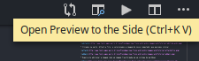

| [Home](../home) | [Adicionando Imagens](./adicionando-imagens) | [Escrevendo em markdown](./escrevendo-em-markdown) | [**Wiki no editor de texto**](./wiki-no-editor-de-texto) |
| :--: | :--: | :--: | :--: |

# Usando o VSCODE para trabalhar em uma Wiki

* De vez de escrevermos Wikis diretamente pelo Gitlab, podemos usar ferramentas para lermos e escrevermos wikis

* Podemos trabalhar com textos em Markdown tambem em editores de texto para programação

* Irei apresentar como é feito no `Visual Studio Code`

* Para visualizar os arquivos em *.md* podemos usar uma extensão do VSCODE chamado `Markdown All in One`

## Passos de Como fazer

* Clone o Repositório da Wiki Desejada(Sim, a wiki é um repositório separado do repositório do seu projeto)
---

---

* Você irá ver um link que você copia para poder fazer o clone
---

---

* Agora abrimos um terminal e fazemos um Clone 

---

---

* Depois de fazer o Clone do Repositório, Iremos abrir o VSCODE no Diretório baixado, como na imagem abaixo:

---

---

* Ele irá abrir o programa e apresentará os arquivos da wiki que você estiver trabalhando

---

---

* No lado Esquerdo tem todos os arquivos em Markdown que foram escritos, que serão tratados como `Páginas` de nossa Wiki

---

---

* Para podermos ver a visualização de nossos arquivos em Markdown, clicamos no botão bem a direita encima, ou no comando que ele mostra:

---

---

* A visualiação é apresentada a direita do Código de Markdown

---

---