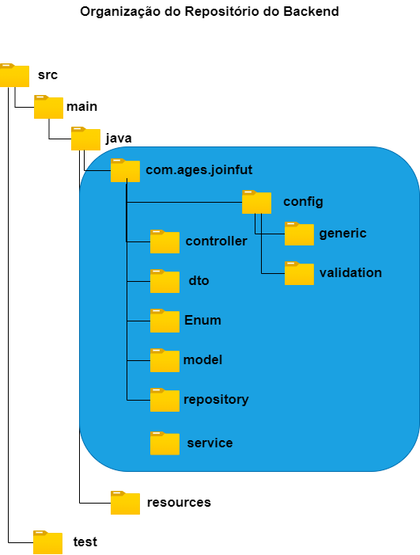
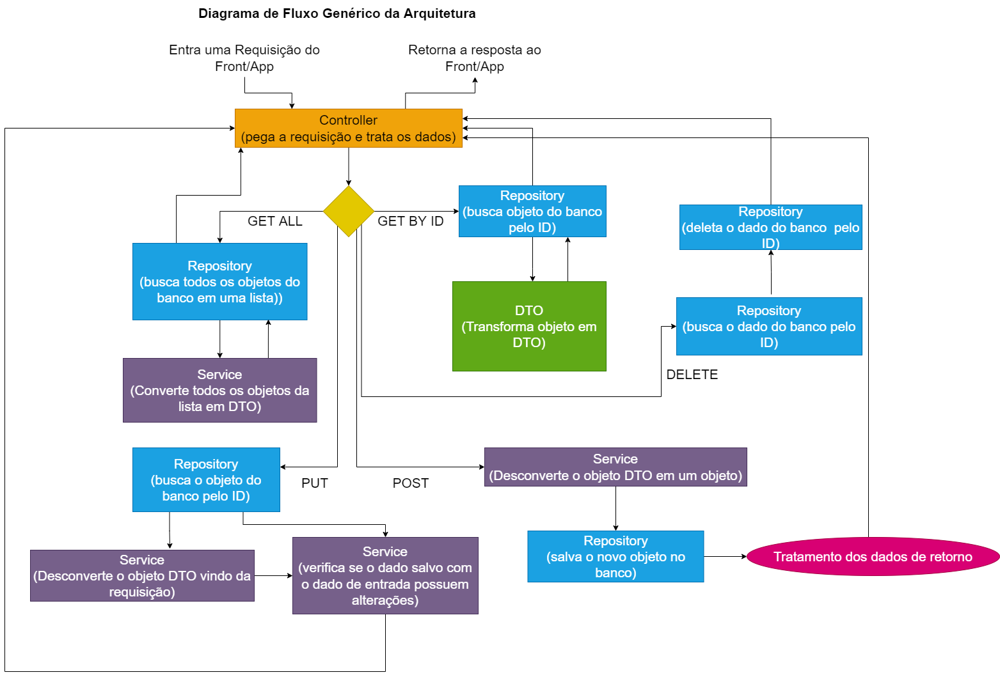

| [Home](home) | [Escopo e Cronograma](escopo) | [Processo](processo) | [Design/Mockups](design_mockups) | [Configuração](configuracao) | [**Arquitetura**](arquitetura) | [Código](codigo) | [BD](banco_dados) | [Qualidade](qualidade) | [Utilização](utilizacao) | [Instalação](instalação)
| :----------: | :---------------------------: | :------------------: | :--------------: | :--------------------------: | :----------------------------: | :--------------: | :---------------: | :--------------------: | :----------------------: | :--------------------------: |

# Arquitetura do Sistema

## Descrição

Esta seção irá abordar a arquitetura selecionada para o Backend e Frontend, além dos dados relativos ao deploy.

## Sumário

- [Arquitetura do Sistema](#arquitetura-do-sistema)
  - [Descrição](#descrição)
  - [Sumário](#sumário)
  - [Arquitetura Geral da Aplicação](#arquitetura-geral-da-aplicação)
  - [Deploy](#deploy)
    - [Recipes API](#recipes-api)
    - [Diagrama de Deploy](#diagrama-de-deploy)
  - [Backend](#backend)
    - [Definições de Tecnologias](#back-end-def-tec)
    - [Módulos do Sistema](#back-end-mods-sis)
    - [Diagrama de Fluxo](#diagrama-de-fluxo)
  - [Frontend](#frontend)
    - [Definições de Tecnologias](#front-end-def-tec)
    - [Módulos do Sistema](#front-end-mods-sis)
    - [Diagramas de Componentes](#diagramas-de-componentes)
    - [Diagrama do Sistema](#diagrama-do-sistema)

## Arquitetura Geral da Aplicação

TBD

## Deploy

### Recipes API

TBD

### Diagrama de Deploy

TBD

## Backend

<h3 id="back-end-def-tec">Definições de Tecnologias</h3>

* [**Java 8**]()
* [**Maven 3.6.3**]()
* [**PostgreSQL 12**]()
* [**Intellij 2022.1**]()
* [**Postman**]()

<h3 id="back-end-mods-sis">Módulos do Sistema</h3>

* **src.main.java** = caminho para os diretórios do projeto.
  * **com.ages.joinfut** = caminho para os arquivos oficiais da arquitetura
    * **config** = diretório onde ficam as configurações globais
      * **generic** = diretório onde ficam os arquivos genéricos utilizados no projeto.
      * **validation** = diretório onde ficam o tratamento de erros e validações globais.
    * **controller** = diretório onde ficam os arquivos de controle das requisições a API REST.
    * **dto** = diretório onde ficam o tratamento de dados e suas validações das requisições para o banco.
    * **Enum** = diretório onde ficam os objetos enumerados (que possuem valores padrões) que podem ser utilizados.
    * **model** = diretório onde ficam as entidades (a estrutura de informações que vão ser salvos no banco).
    * **repository** = diretório onde ficam os arquivos de tratamento das camadas de persistência do JPA.
    * **service** = diretório onde ficam validações mais complexas e funções utilizadas pelas requisições.
  * **resources** = diretório onde fica o `application.properties` com as configurações do spring
  * **test** = diretório onde ficam os testes do projeto

### Diagramas

#### Diagrama do caminho das requisições

## Frontend

<h3 id="front-end-def-tec">Definições de Tecnologias</h3>

TBD

<h3 id="front-end-mods-sis">Módulos do Sistema</h3>

TBD

### Diagramas de Componentes

TBD

### Diagrama do Sistema

TBD
