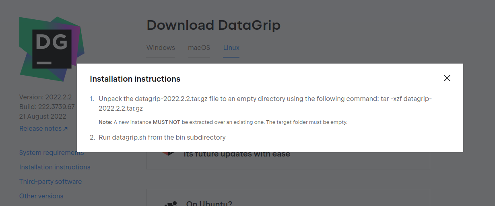

### Wiki normal

<br>

[](home)
[](Instalação)

---

### Wiki Backend

<br>

[](backend/backend_home)
[](backend/java_instalacao)
[](backend/maven_instalacao)
[](backend/postman_instalacao)[](backend/intellij_instalacao)
[](backend/datagrip_instalacao)

<br>

[]()

---

# Instalação do Intellij

## Glossário

* [**Linux**](backend/intellij_instalacao#linux)
* [**Windows**](backend/intellij_instalacao#windows)
* [**Extensões**](backend/intellij_instalacao#extensao)

---

<a name="linux"></a>

## Linux

aixe a ultima versão do Datagrip no [Site oficial](https://www.jetbrains.com/datagrip/download/#section=linux)


Deixe terminar de baixar o instalador, enquanto isso crie uma conta de estudante do Datagrip [AQUI](https://www.jetbrains.com/pt-br/community/education/#students)

Faça a extração do arquivo .tar.gz com o comando `tar -xzf <nome_Arquio>.tar.gz` no diretório de sua escolha



Depois acesse o diretório **bin** do novo diretório gerado e rode o script `datagrip.sh`, esse é o script que roda o Datagrip, você pode utilizar o Script [DatagripStarter.sh](https://tools.ages.pucrs.br/Joinfut/joinfut-database/-/blob/main/Script_Linux/DatagripStarter.sh) para automatizar o inicio do Datagrip, sendo que o Datagrip deve estar na pasta download e o script na pasta desktop e dai só rodar o arquivo pelo terminal com o seguintes comandos:

```shell
cd Desktop
chmod +x DatagripStarter.sh
./DatagripStarter.sh
```

---

<a name="windows"></a>

## Windows

Va até a [página oficial](https://www.jetbrains.com/datagrip/) do Datagrip

Clique em fazer o Download


Deixe instalar completamente no seu computador


Quando tiver terminado a instalação ele vai mostrar a página abaixo


Deixe o local de salvamento padrão


Selecione todas as opções de modificadores que precisa e clique em **NEXT**


Clique para instalar e deixe ele concluir a instalação


Pronto! dai só clicar para reiniciar o computador para terminar de instalar tudo.


---

<a name="extensao"></a>

## Extensões úteis

* Uma extensão muito boa é o github theme, onde deixa o datagrip mais escuro, deixando melhor de ver as informações

Acesse os **Settings** do datagrip.


Acesse a página **Plugins** e procure pela extensão **Github Themes**


