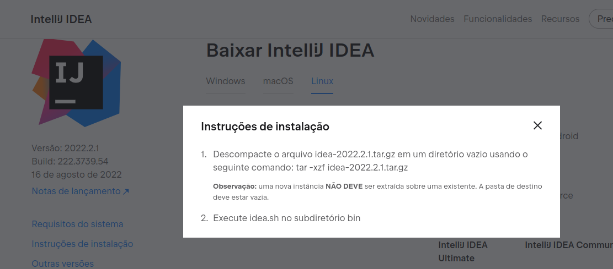
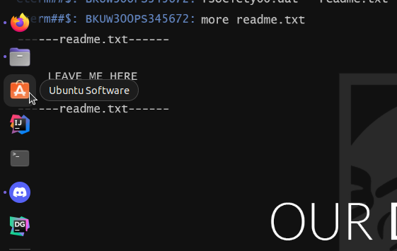
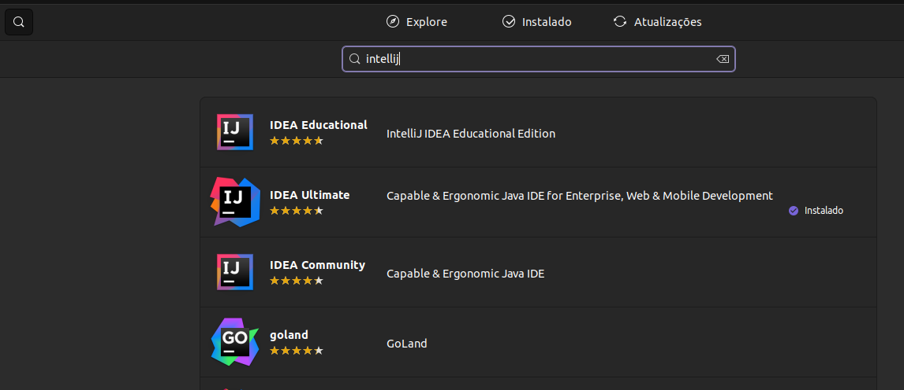
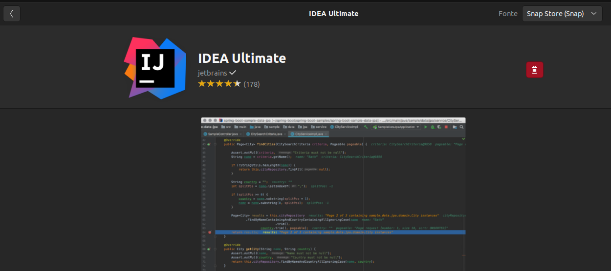
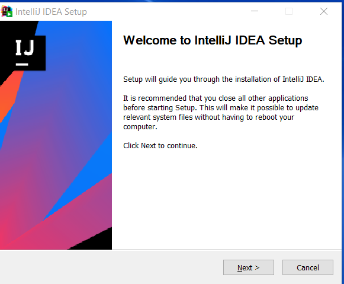
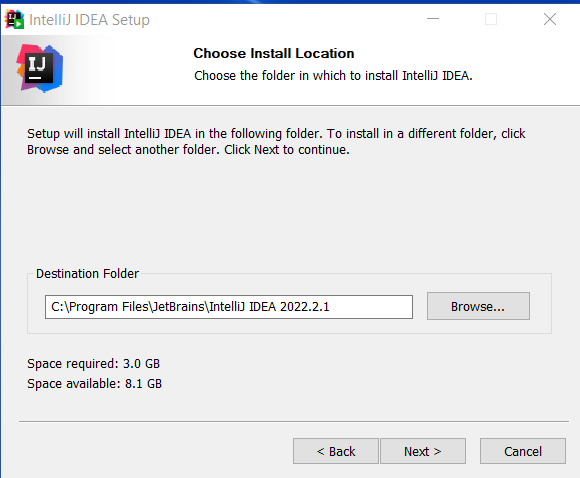
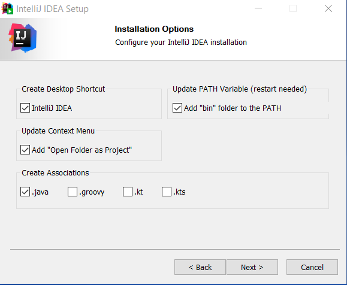
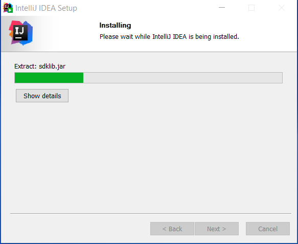
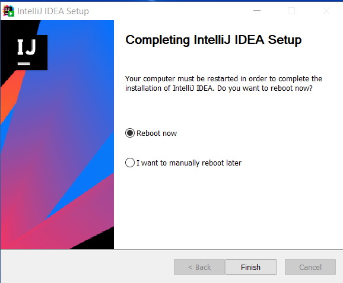

[](home)
[](Instalação)

---

# Instalação do Intellij

## Glossário

* [**Linux**](backend/intellij_instalacao#linux)
* [**Windows**](backend/intellij_instalacao#windows)
* [**Extensões**](backend/intellij_instalacao#extensao)

---

<a name="linux"></a>

### Linux

aixe a ultima versão do Intellij no [Site oficial](https://www.jetbrains.com/pt-br/idea/download/)

A versão completa do Intellij é a **Ultimate**

Deixe terminar de baixar o instalador, enquanto isso crie uma conta de estudante no intellij [AQUI](https://www.jetbrains.com/pt-br/community/education/#students)

Faça a extração do arquivo .tar.gz com o comando `tar -xzf <nome_Arquio>.tar.gz` no diretório de sua escolha



Depois acesse o diretório **bin** do novo diretório gerado e rode o script `idea.sh`, esse é o script que roda o intellij, você pode utilizar o Script [IntellijStarter.sh](https://tools.ages.pucrs.br/Joinfut/joinfut-database/-/blob/main/Script_Linux/IntellijStarter.sh) para automatizar o inicio do intellij, sendo que o intellij deve estar na pasta download e o script na pasta desktop e dai só rodar o arquivo pelo terminal com o seguintes comandos:

```shell
cd Desktop
chmod +x IntellijStarter.sh
./IntellijStarter.sh
```

**Pelo Ubuntu**

Acesse o **Ubuntu Software**



Deixe carregar o catálogo de programas


Pesquise pelo intellij e selecione o **ultimate**



Ele vai abrir uma página com informações e só clique para instalar que ele vai fazer todo o trabalho, para inciar é só procurar por ele no seu ubuntu.



---

<a name="windows"></a>

### Windows

Baixe a ultima versão do Intellij no [Site oficial](https://www.jetbrains.com/pt-br/idea/download/)

A versão completa do Intellij é a **Ultimate**


Deixe terminar de baixar o instalador, enquanto isso crie uma conta de estudante no intellij [AQUI](https://www.jetbrains.com/pt-br/community/education/#students)


Após baixado e tendo a conta de estudante, clique no instalador e vai aparecer a página abaixo, clique em **Next**



Selecione onde vai ser instalado o intellij, é recomentado deixar o caminho padrão dele, como mostra abaixo



Selecione para que ele coloque no PATH do windows automaticamente o intellij, além de que a linguagem do programa é principalmente java e criar um atalho no seu desktop



Deixe ele fazer a instalação e configurações necessárias



Pronto! agora deixe ele reiniciar o computador e quando iniciar o intellij faça login na conta de estudante criada



---

<a name="extensao"></a>

### Extensões úteis

1) Tema do github

Existem vários temas disponiveis para o intellij, mas o meu favorito é o tema do github:

