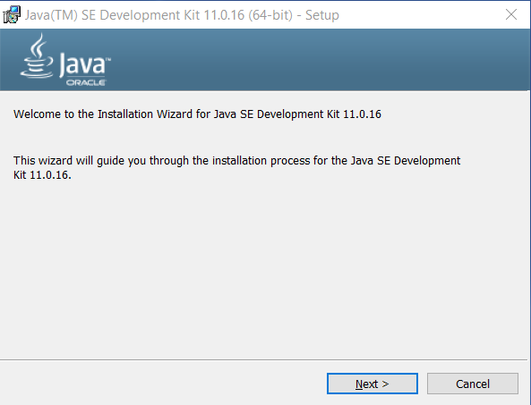
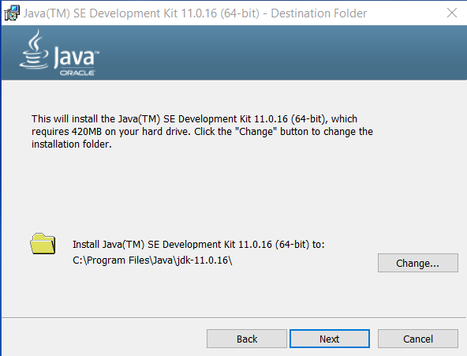
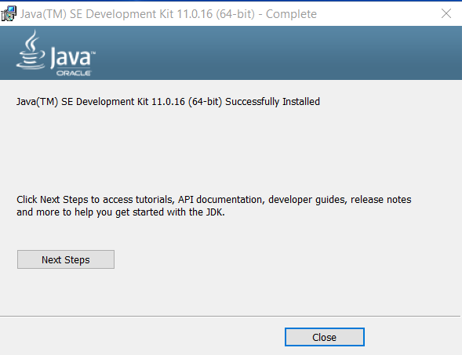
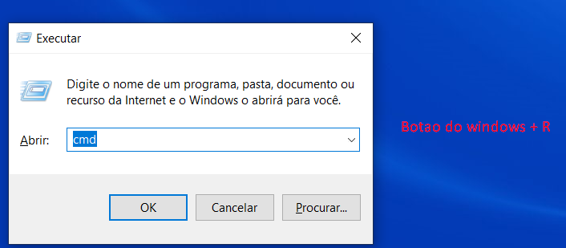
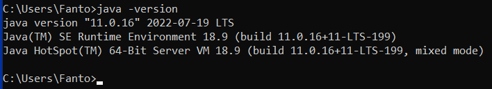
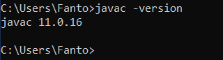

### Wiki normal

<br>

[](home)
[](Instalação)

---

### Wiki Backend

<br>

[](backend/backend_home)
[](backend/java_instalacao)
[](backend/maven_instalacao)
[](backend/postman_instalacao)[](backend/intellij_instalacao)
[](backend/datagrip_instalacao)

<br>

[]()

---

# Instalação do Java para o projeto

* Versão do Java que iremos utilizar: 

## Glossário

- [**Java no Linux**](backend/java_instalacao#linux)
- [**Java no Windows**](backend/java_instalacao#windows)

---

<a name="linux"></a>

### Linux

**Instalação do Java 11 no linux**

```shell
sudo apt install openjdk-11-jre-headless
```

* Para testar se instalou

```shell
java --version

#openjdk 11.0.16 2022-07-19
#OpenJDK Runtime Environment (build 11.0.16+8-post-Ubuntu-0ubuntu122.04)
#OpenJDK 64-Bit Server VM (build 11.0.16+8-post-Ubuntu-0ubuntu122.04, mixed mode, sharing)
```

**Instalação do Javac (Java compiler) no linux**

```shell
sudo apt install openjdk-11-jdk-headless
```

* Para testar se instalou

```shell
javac --version

#javac 11.0.16
```

**Java 11.0.16** é a ultima versão dessa versão do java

<a name="windows"></a>

### Java no Windows

* O arquivo para baixar o Java 11 para facilitar o trabalho se encontra [Aqui](https://drive.google.com/file/d/1oRNhV8FQokBOebcAWhkjy0zM0ih1hlvv/view?usp=sharing).
    * Esse arquivo é o **Java JDK**, é o Java necessário para o desenvolvimento nessa linguagem.

Para instalar o programa no windows, clique duas vezes nele e verá a seguinte página:

Clique em **Next**.



Clique em **Next**.



Ele vai instalar o Java em seu computador na pasta definida acima e configurar o JAVA_PATH automaticamente nas suas variáveis de ambiente, versões anteriores não faziam isso por nós.



Depois de instalado, abra um terminal clicando <kbd>Windows</kbd> + <kbd>R</kbd> e escrevendo **cmd**.



No terminal rode o seguinte comando: `java -version` para verificar se tem o java padrão instalado.



Por último, para verificar se o JDK foi instalado com sucesso, rode o comando `javac -version`, se aparecer a mensagem da versão do java compiler, funcionou.

