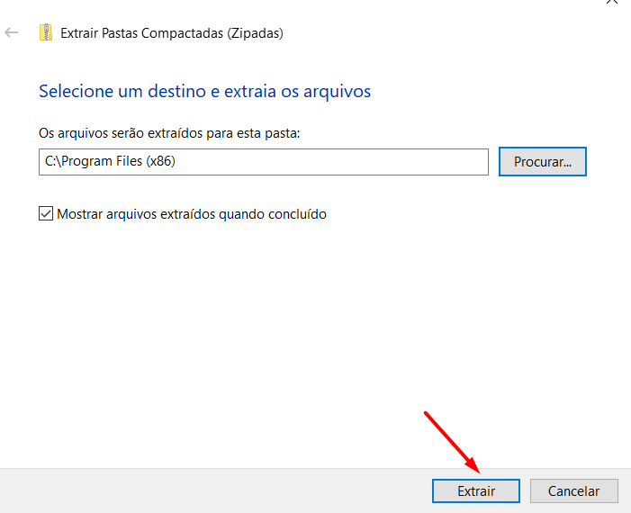
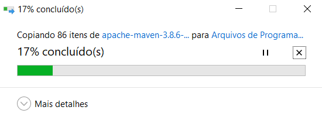

### Wiki normal

<br>

[](home)
[](Instalação)

---

### Wiki Backend

<br>

[](backend/backend_home)
[](backend/java_instalacao)
[](backend/maven_instalacao)
[](backend/postman_instalacao)[](backend/intellij_instalacao)
[](backend/datagrip_instalacao)


<br>

[]()

---

# Instalação do Maven

* Versão do Maven que iremos utilizar: 

## Glossário

* [**Linux**](backend/maven_instalacao#linux)
* [**Windows**](backend/maven_instalacao#windows)

---

<a name="linux"></a>

### Linux

* Abra um console e coloque os seguintes comandos

```shell
cd ~/Downloads/
wget https://mirrors.estointernet.in/apache/maven/maven-3/3.6.3/binaries/apache-maven-3.6.3-bin.tar.gz
tar -xvf apache-maven-3.6.3-bin.tar.gz
sudo mv apache-maven-3.6.3 /opt/
```

* Abra o arquivo do perfil (.profile) com o vim

```shell
vim ~/.profile
```

* Coloque no arquivo (copie e cole com Ctrl+ C e Ctrl + V) no arquivo

```shell
M2_HOME='/opt/apache-maven-3.6.3'
PATH="$M2_HOME/bin:$PATH"
export PATH
```

* Após colado essa info, feche o VIM com `:wq`
* Atualize o arquivo profile com o comando abaixo:

```shell
source ~/.profile
```

* Verifique se o maven foi devidamente instalado:

```shell
mvn -version

# Apache Maven 3.6.3 (cecedd343002696d0abb50b32b541b8a6ba2883f)
# Maven home: /opt/apache-maven-3.6.3
# Java version: 11.0.16, vendor: Ubuntu, runtime: /usr/lib/jvm/java-11-openjdk-amd64
# Default locale: pt_BR, platform encoding: UTF-8
# OS name: "linux", version: "5.15.0-46-generic", arch: "amd64", family: "unix"
```

---

<a name="windows"></a>

### Maven no Windows

* Baixe o Maven do projeto escolhido [Aqui](https://drive.google.com/file/d/1n8T50n9bRk9PEYk4jdpMbFRvyaHf5TXT/view?usp=sharing)
    * Coloque o .zip do maven no diretório **Downloads**

Clique com o botão direito encima do .zip do maven e procure pela opção **Extrair Tudo...**


Vai abrir uma página pedindo a localização para extrair, clique no botão **Procurar...**


Selecione o seu computador oficial de uso, normalmente o **C:/**


Selecione os **Arquivos de Programas (X86)**


Essa é a pasta para onde devemos enviar os dados do **.zip**


Clique no botão de **Extrair**



Dê a permissão para o seu computador poder fazer essa ação


Deixe ele concluir a extração



Pronto! ele vai criar um diretório nos arquivos de programas com o nome do programa e a versão dele.


Acesse a página **Editar as variáveis de ambiente do sistema**


Clique em **Variáveis de Ambiente**


Clique em **Novo...** na parte das variáveis do sistema


Copie e cole o caminho até a pasta do maven criada dentro dos Arquivos de Programas (x86), normalmente é o `C:/Program Files (x86)/apache-maven-3.8.6`

Coloque o nome dessa variável como **MAVEN_HOME**


Agora devemos clicar para editar o **Path** das variáveis de ambiente


Clique para criar um **Novo**


Coloque a variável do Maven criada e coloque a pasta interna dele chamada **bin**, dessa forma `%MAVEN_HOME%/bin`.


Agora iremos abrir um console com <kbd>Windows</kbd> + <kbd>R</kbd> e escrever **cmd**


Testamos para ver se instalou o maven com o comando `mvn -version`, se aparecer as informações de versão, significa que foi instalado com sucesso.


