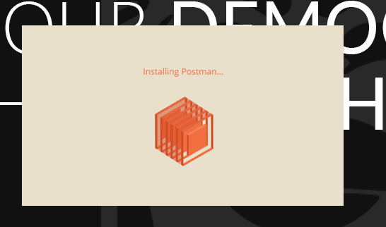
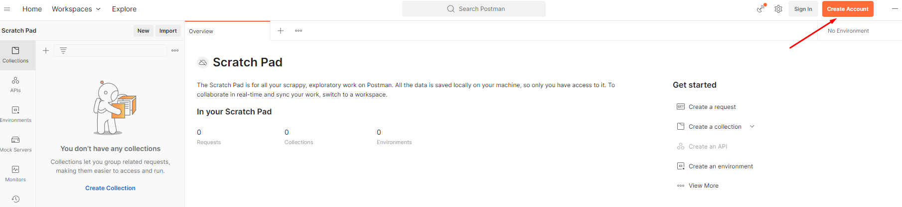

### Wiki normal

<br>

[](home)
[](Instalação)

---

### Wiki Backend

<br>

[](backend/backend_home)
[](backend/java_instalacao)
[](backend/maven_instalacao)
[](backend/postman_instalacao)[](backend/intellij_instalacao)
[](backend/datagrip_instalacao)

<br>

[]()


---

# Instalação do Postman

---


## Glossário

|Ordem|Tópico|
|---|---|
|1|[**Linux**](backend/postman_instalacao#linux)
|2|[**Windows**](backend/postman_instalacao#windows)
|3|[**Utilizando postman no projeto**](backend/postman_instalacao#use)

---

<a name="linux"></a>

## Postman no Linux

* Acesse [Site oficial](https://www.postman.com/downloads/)
* Abra um console no diretório onde foi baixado o postman:

```shell
$ tar -xzvf tar -xzvf postman-linux-x64.tar.gz 
```

* Acesse o Diretório criado e rode o executável **Postman**

```shell
$ cd Postman
$ ./Postman
```

* Faça login no seu email Google
* Pode trocar o tema para escuro caso seja muito claro

---

<a name="windows"></a>

## Postman no Windows

* Acesse a página ofical de Download do [Postman](https://www.postman.com/downloads/)


* Deixe terminar de baixar o .exe e o salve onde quiser


* Quando clicar no .exe, ele vai automaticamente instalar o postman em seu computador.



* Crie uma conta ou faça login em uma conta do google



* Após logado, clique na engrenagem no canto direito encima e selecione **Settings**


* Você pode escolher o tema desejado na aba **Themes**


* Se desejar conhecer mais sobre o postman, ele possui uma excelente [Documentação](https://learning.postman.com/docs/getting-started/introduction/)


---

<a name="use"></a>

## Utilizando o postman no projeto

* Para utilizar o postman, leia a wiki [](postman_utilizacao)
