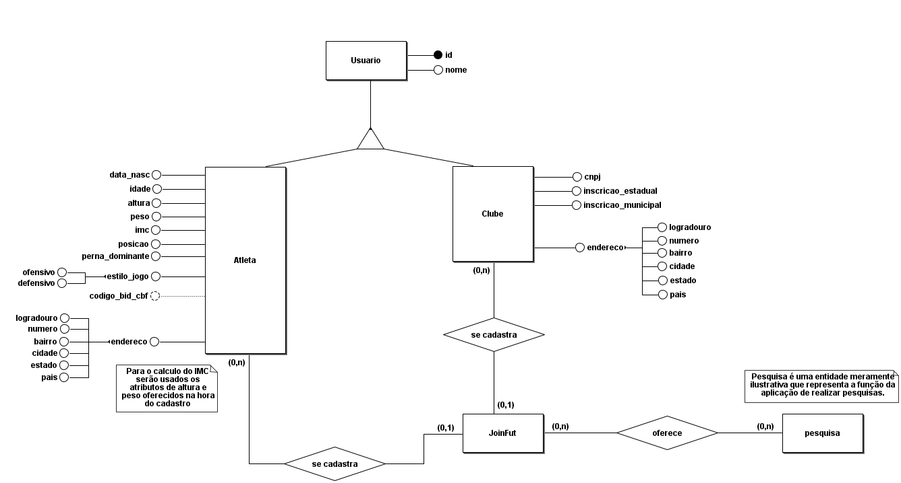
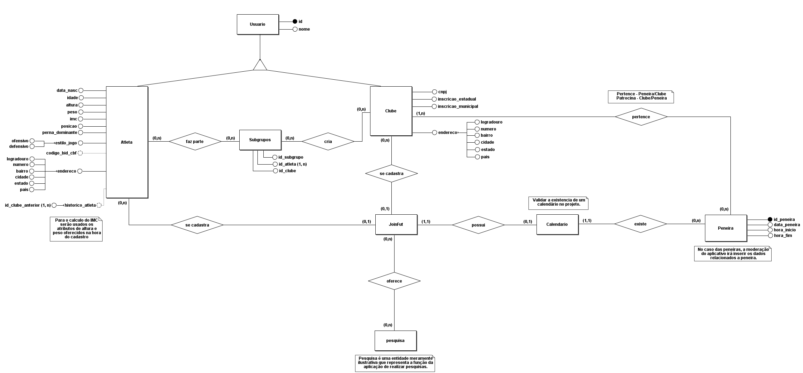
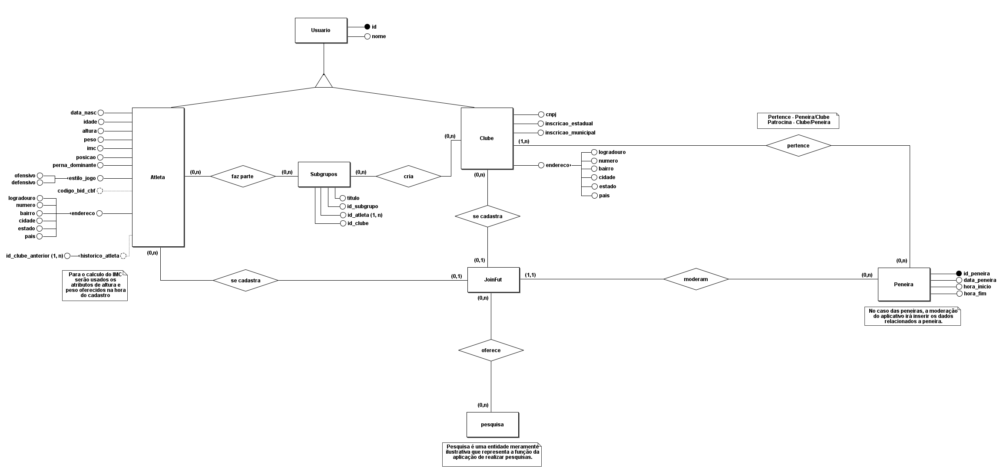
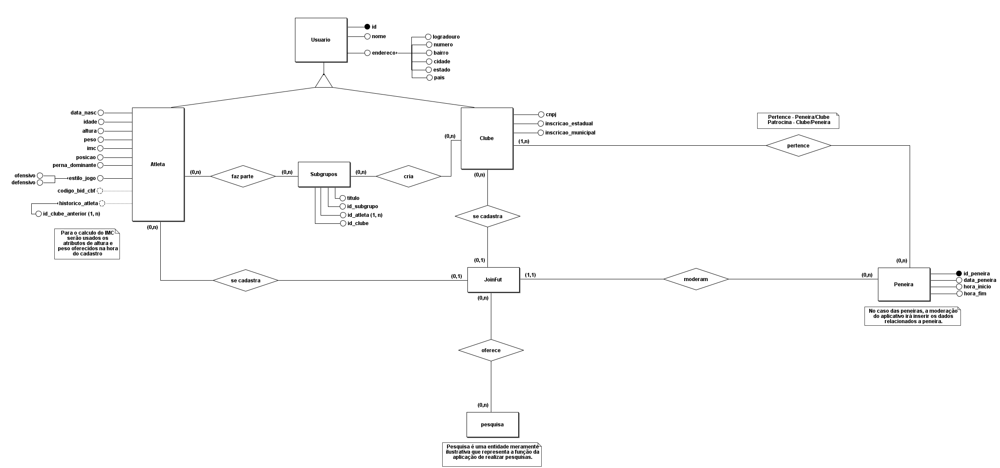
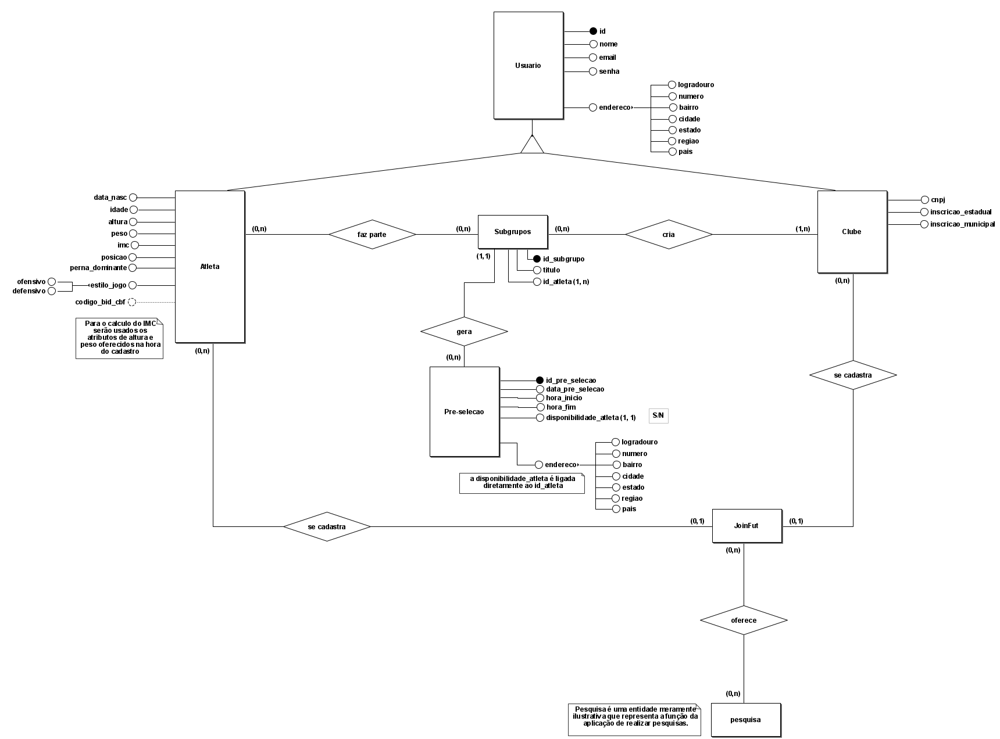

---

# Banco de Dados

## Descrição

Para o sistema, foi definido que seria utilizado o banco de dados Postgres. Esta decisão foi tomada em conjunto com a equipe, após uma votação entre outras tecnologias levantadas no dia oito de agosto de dois mil e vinte e dois.

## Sumário

- [Modelagem](#modelagem)
  - [Esquema Conceitual](#esquema-conceitual)
  - [Esquema Lógico](#esquema-lógico)
- [Implementação](#implementação)
  - [Knex](#knex)
  - [Schemas](#schemas)
  - [Postgrees](#postgrees)

## Modelagem

 

### **Esquema Conceitual**

 

### Sprint 0

 

Durante a sprint zero, foram definidas as primeiras entidades que serão realizadas pela equipe, sendo elas os dois usuários maiores do sistema: Atleta e Clube.

Durante a primeira versão do projeto, foi definido que seria utilizado o método de especialização, criando-se uma entidade descrita como Usuário, contendo id e nome. A partir deste, foram criadas as entidades Atleta e Clube.

Para a entidade Atleta, temos os atributos:
- peso
- perna_dominante
- altura
- imc
- data_nascimento
- idade
- posicao
- estilo_jogo
- codigo_bid_cbf (opcionall)
- endereco
    - logradouro
    - numero
    - bairro
    - cidade
    - estado
    - pais

Para a entidade Clube, temos os atributos:
- cnpj
- inscricao_estadual
- inscricao_municipal
- endereco
    - logradouro
    - numero
    - bairro
    - cidade
    - estado
    - pais

Podemos ver também a entidade JoinFut, que representa o aplicativo neste modelo. E por fim a entidade Pesquisa, que neste modelo é meramente representativa da função de realizar pesquisas que a aplicação deve realizar.

 

A modelagem para esta etapa do proceso foi realizada com a ferramenta BrModelo em sua versão 3.31.

 

Abaixo, segue definida a modelagem conceitual do projeto na Sprint 0:

 

### Sprint 1

 

Seguindo o processo de modelagem na sprint 1, foram definidas novas entidades e relações no modelo conceitual do projeto. As entidades novas são: Subgrupos, Calendário e Peneira

A entidade Subgrupo se baseia na capacidade de um clube poder adicionar Atletas específicos a uma determinada lista. Ela é composta pelos atributos: 
- id_subgrupo
- id_atleta
- id_clube

A entidade Calendário é meramente ilustrativa, demonstrando a existência de um calendário dentro da aplicação.

E por fim a entidade Peneira, que se baseia na capacidade de peneiras serem criadas na aplicação para a divulgação patrocinada/oferecida por clubes em buscas de atletas. Ela é composta pelos atributos: 
- id_peneira
- data_peneira
- hora_inicio
- hora_fim

Também houveram alterações pequenas na entidade Atleta, com a adição de um novo atributo opcional, composto e multivalorado, que seria o histórico do atleta, relacionado a suas participações anteriores em outros clubes.

- historico_atleta
	- id_clube_anterior

 

Abaixo, o primeiro modelo desta etapa:

 

Após a apresentação deste modelo, foi validado com os demais membros da equipe responsável pela modelagem, que alterações deveriam ser feitas para a melhor compreensão do modelo.

As alterações são resumidas em:
Remoção da entidade Calendário da modelagem.
Adição de um novo atributo na entidade Subgrupo, chamado: título.

A entidade Calendário fora removida devido ao fato que não havia necessidade de sua existência, vendo que o calendário na aplicação seria utilizado somente para a visualização de peneiras.

E adição de um novo atributo na entidade de Subgrupo fora simplesmente para que o usuário clube possa livremente dar nomes às listas de atletas que deseja criar.

 

Abaixo, o modelo com suas alterações:

 

E, para a atualização do modelo conceitual do banco, os atributos de endereço dos usuários Atleta e Clube foram colocados juntamente com a entidade Usuário, para evitar redundância de dados. 

 

Abaixo, o modelo conceitual relacionado a esta atualização: 

 

Durante a Sprint, tivemos novas informações apresentadas pelos Stakeholders, logo, foram necessárias novas atualizações no modelo do banco de dados. Estas tendo grande impacto na modelagem e alterando uma boa parte do modelo original proposto. 

Foi validado com o cliente que as peneiras da aplicação teriam uma troca de nome, agora chamadas de pré-selecao, possuidoras dos seguintes atributos:

- endereco
    - logradouro
    - numero
    - bairro
    - cidade
    - estado
    - pais

Essa pré-seleção é criada a partir de um subgrupo, e engloba a ação de um clube poder iniciar uma “peneira” com os atletas já pré-selecionados pelo clube em subgrupos.

Ocorreu também a adição do campo de email e de senha do usuário, juntamente com a remoção do histórico de clubes do atleta.

Abaixo, o modelo conceitual relacionado a esta atualização:

 

 

E para a finalização do modelo conceitual, foi levantado com a equipe a necessidade de mais uma entidade, chamada de Avaliação. Esta entidade deve englobar a capacidade do clube de dar dar notas a um atleta após a conclusão de sua pré-seleção.

A entidade Avaliação possui os seguintes atributos:
- id_avalicao
- nota_clube

 

**Abaixo, o modelo conceitual da aplicação completo, englobando todas as requisições do cliente :**

 

### **Esquema Lógico**

 

### Sprint 1

 

TBD

## Implementação

TBD

### Knex

TBD

### Schemas

TBD

### Postgrees

TBD

### Ferramentas Utilizadas

- [BrModelo 3.31](https://www.sis4.com/brModelo/download.html).

 

*Wiki editada por: [Alexya Silva Rocha de Oliveira](https://tools.ages.pucrs.br/alexya.oliveira)*
