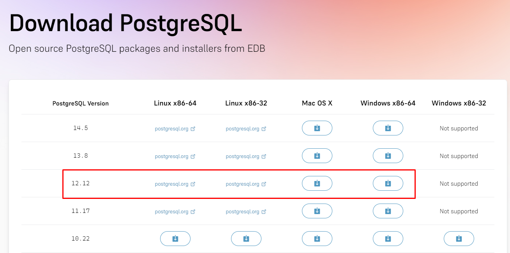
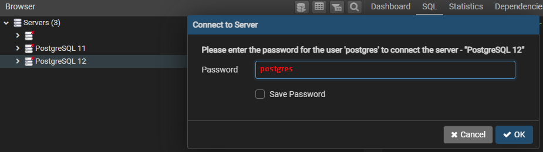

[](home)
[](Instalação)

---

# Instalação do PostgreSQL

* Versão do PostgreSQL para baixar: 

## Glossário

* [**Linux**](database/postgresql_instalacao#linux)
* [**Windows**](database/postgresql_instalacao#windows)

---

<a name="linux"></a>

## Linux

- **POSTGRESQL**

1) Instalando o postgresql no linux

```shell
# criando o arquivo de configuração do postgresql
sudo sh -c 'echo "deb http://apt.postgresql.org/pub/repos/apt $(lsb_release -cs)-pgdg main" > /etc/apt/sources.list.d/pgdg.list'

# import das chaves do postgresql
wget --quiet -O - https://www.postgresql.org/media/keys/ACCC4CF8.asc | sudo apt-key add -

# atualizar o sistema
sudo apt-get update

# instalação do postgresql versão 12 e sua dependencia de contribuição
sudo apt-get -y install postgresql-12 postgresql-contrib

# testar se o postgres foi instalado com sucesso
apt show postgresql
# sudo systemctl status postgresql
sudo pg_isready
```

2) Dando uma senha para o postgres

```shell
# acessando o template inicial do postgres
sudo -u postgres psql template1

# Alterando o usuario postgres e colocando a senha (obs: não esqueça o ; final)
ALTER USER postgres with encrypted password 'postgres';

# Clique Ctrl + D para sair do postgres
# acesse o arquivo abaixo
sudo vim /etc/postgresql/12/main/pg_hba.conf

# troque a mensagem de vez de peer para md5 e depois salve no vim (:wq)
local all postgres md5

# reinicie o arquivo de configuração
sudo /etc/init.d/postgresql restart

# Acesse seu usuario
psql -U postgres

# se pedir a senha de depois logar, funcionou corretamente
```

3) Criando uma base de dados pelo console

```shell
# pelo console comum, iremos usar o comando createdb
createdb -h localhost -p 5432 -U postgres <nome base>
```

* onde está escrito `<nome base>` você coloca o nome da base de dados
* o comando oficial que iremos usar é o abaixo

```shell
createdb -h localhost -p 5432 -U postgres joinfut
```

* Ele vai pedir a senha do usuario postgres e vai criar

4) Acessando a base de dados em um programa

* O melhor programa do mercado para ele é o [**Datagrip**](https://www.jetbrains.com/datagrip/download/?source=google&medium=cpc&campaign=15034927825&term=datagrip&gclid=Cj0KCQjw9ZGYBhCEARIsAEUXITUIhh1cPnp63OxJKXGRFET-UVxhvsri2Iga3RZm5zSMqvaykbdsqKoaAji3EALw_wcB#section=linux)

* Nele, colocamos os dados necessários, como abaixo:


* Com isso, estamos conectados no banco de dados e na base de dados que iremos utilizar

---

<a name="windows"></a>

## PostgreSQL no Windows

* Acesse este site para fazer [Download](https://www.enterprisedb.com/downloads/postgres-postgresql-downloads)

* Baixe a versão **12.12** do PostgreSQL 


---

* Ele vai começar a baixar e vai mostrar um tutorial de como instalar, mas esse aqui ja é o suficiente, com detalhes para o nosso projeto


---

* Deixe terminar de baixar


---

* Após baixado, clique no **.Exe** e libere as permissões para começar a instalar o programa. 


---

* Mantenha o diretório padrão de instalação e clique em **NEXT**


---

* Deixe todas as opções marcadas e só clique em **NEXT**


---

* Ele vai mostrar qual pasta vai ser instalado os extras, mantenha o padrão e clique em **NEXT**


---

* O **usuário** e **senha** padrão para teste local é [**posgtres**](), depois de colocar nos dois clique em **NEXT**


---

* A porta liberada para o projeto deve ser a porta [**5433**](), só clique em **NEXT**


---

* Selecione a linguagem para o Português do brasil e clique em **NEXT**


---

* Ele vai mostrar um resumo de tudo que vai ser instalado e alterado, só clicar em **NEXT**


---

* Agora vai começar a instalação, deixe concluir ela


---

* Depois de instalado, ele vai pedir para começar um outro programa chamado **Stack Builder** para instalar os outros programas que vem junto com o PostgreSQL 


---

* Selecione qual o sistema de banco de dados vai ser utilizado para fazer a instalação, **Tenha certeza** de qual banco postgreSQL está sendo usado


---

* Selecione o **PgAgent** como extensão que deseja instalar, porque ele auxilia o pessoal do windows a visualizar dados


---

* Diga qual o diretório onde ele vai instalar os extras, deixe o diretório padrão se esse diretório é no seu computador.


---

* Deixe ele fazer a instalação dos extras


---

* Após baixado todos os extras, somente clique em **NEXT** para continuar 


---

## Instalação do PgAgent

* Agora vai começar a configuração do PgAgent, que vai instalar o programa **PgAdmin**, que é o visualizados do PostgreSQL dos bancos de dados, mas iremos usar como padrão o Datagrip, clique em **NEXT**


---

* Nessa tela só clique em **NEXT**


---

* As informações do Pgadmin devem ser as mesmas do postgres, portanto ele trás alguns dados padrão como abaixo, mas a senha tem que ser para o local [**postgres**](), depois só clique em **NEXT**


---

* Usuario de acesso também, **usuário** e **senha** como [**postgres**]()


---

* Clique em **NEXT** que ele vai começar a instalação do PgAgent


---

* Ele vai mostrar que foi criado o pgAgent e que foi criado o Schema padrão postgres


---

* Só clicar **NEXT** nas próximas duas telas para finalizar


## Testando a instalação

* Procure por **PgAdmin** em seu computador


---

* Clique para iniciar, ele vai mostrar uma área de carregamento


---

* Quando finalizar o carregamento, ele vai pedir a senha de acesso, a senha é [**postgres**]() como definido na instalação.


---

* No canto esquerdo, tem os servidores instalados em seu computador, procure pelo [**PostgreSQL 12**]()


---

* Clique duas vezes encima dele e ele vai pedir outra senha, essa senha também é [**postgres**]()



---

* Clique com o botão direito encima do nome do **Database** e selecione **Create > Database**


<br>


---

* Coloque o nome do database como **joinfut** (assim como está escrito) e deixe como owner o **postgres**
* Depois disso só clicar em **Save**


---

* Ele vai criar o nosso database e vai mostrar no canto direito as informações sobre ele e ele vai aparecer no canto esquerdo, como mostrado abaixo


---

## Acessando no Datagrip

* Agora iremos acessar o Datagrip e iremos conectar no banco de dados criado
* Clique no **+** bem na ponta esquerda do programa para podermos fazer uma conexão


---

* Selecione a opção **Data Source** e depois **PostgreSQL**


---

* Ele vai abrir para colocar as informações da conexão, antes de colocarmos os dados, temos que baixar as dependencias do drive do postgreSQL como mostra na imagem


---

* Os dados essenciais para a conexão são
  * Nome do projeto é opcional, mas se quiser coloque **Projeto Joinfut**
  * Host é **localhost**
  * Port é **5433**
  * User é **postgres**
  * Password é **postgres**
  * Database é **joinfut**
  * URL é gerada automaticamente com os dados acima, É A MESMA URL QUE VAI APARECER NO BACKEND NO APPLICATION.PROPERTIES

* Clique em **Test Connection** para ver se foi configurado direito e depois em **Apply** e **OK**


---

* Pronto! agora o datagrip vai configurar sozinho, iniciar o banco e abrir um console como abaixo, é nesse console que iremos colocar os comando em SQL do projeto


