

---

# Design do Sistema

## Descrição

Ao longo da _Sprint_ 0, o time desenvolveu as telas de baixa fidelidade com o objetivo de alinhar as expectativas de design com os _stalkeholders_. As telas foram pensadas buscando performar um fluxo intuitivo e de fácil entendimento para o futuro uso da aplicação.

Os protótipos de tela foram realizados através da ferramenta Figma, contando com a colaboração da equipe simultaneamente na edição das telas. O resultado total pode ser visualizado através do _link_ [Joinfut](https://www.figma.com/file/2Eqdteoq094EfowEjQz83E/JoinFut?node-id=0%3A1).

 

## Protótipos de Baixo Nível

Seguindo a ideia apresentada pelos _stakeholders_, foram primeiro criados modelos alguns modelos simples feitos a mão sobre as telas base, sendo elas as telas _login_ e cadastro.

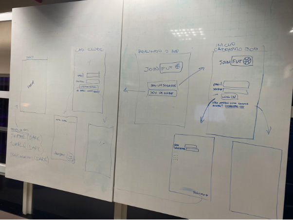

 

Após este primeiro exemplo, a equipe deu andamento para a modelagem na ferramenta Figma, utilizando-se das cores pré apresentadas pelos stakeholders.

 

## Login 

  

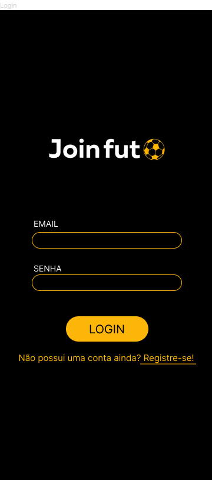

  

### Descrição:
Tela de _login_ da aplicação, onde o usuário pode fazer _login_ utilizando os dados cadastrados no sistema da Joinfut, ou realizar o cadastro no sistema da Joinfut.

 

## Escolha do usuário(fluxo)

 

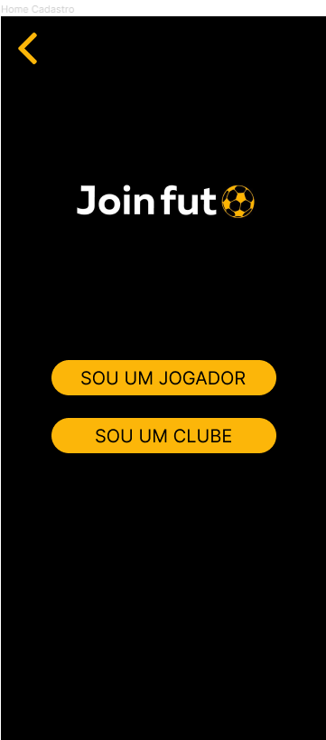

 

### Descrição:
Tela inicial de cadastro, onde é possível escolher o tipo de usuário que fará o cadastro.

 

## Cadastro Atletas/Clube

 

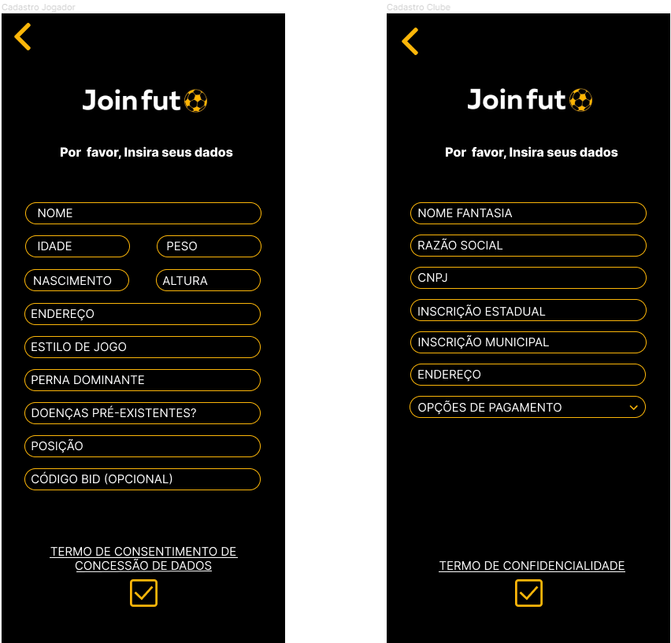

 

### Descrição:
Telas de cadastro apresentadas para o usuário Atleta e usuário Clube, respectivamente. São requisitadas as informações necessárias para a inserção dos dados no banco do sistema. Próximo ao fim da página, há um botão para a validação dos dados.

 

## Termos de uso

 

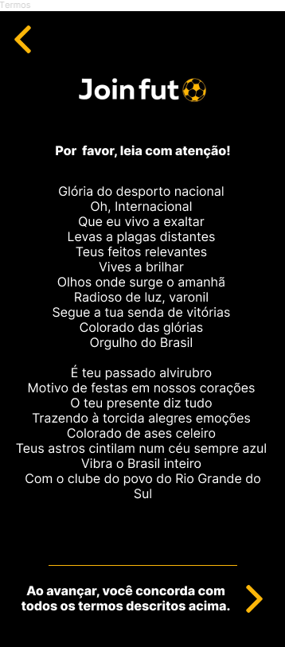

 

### Descrição:
Tela de termos de uso. Cada usuário (atleta e clube), após realizar o cadastro no aplicativo, serão redirecionados para a tela onde constam os termos de uso do mesmo (cada termo é específico para o usuário em questão).

 

## Home calendário(atleta) & Menu lateral

 

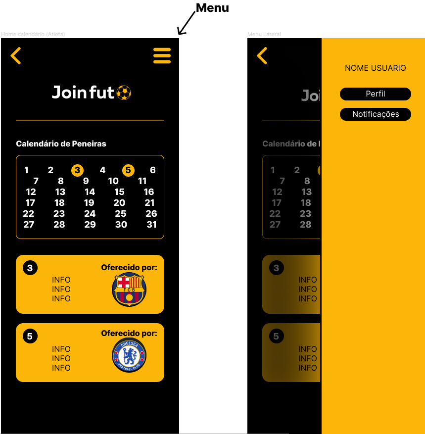

 

### Descrição:
Foi definido pela equipe que no fluxo do usuário, sua _homepage_ seria o calendário. Essa tela representa as datas que ocorrerão as peneiras, juntamente com os times que as estão oferecendo. Há também um _widget_ no canto superior direito que leva para um menu lateral. Neste menu existem as opções:
* Perfil: leva o atleta para a tela de seu perfil.
* Norificações: ---------

 

## Home filtro(clube) & Menu lateral

 

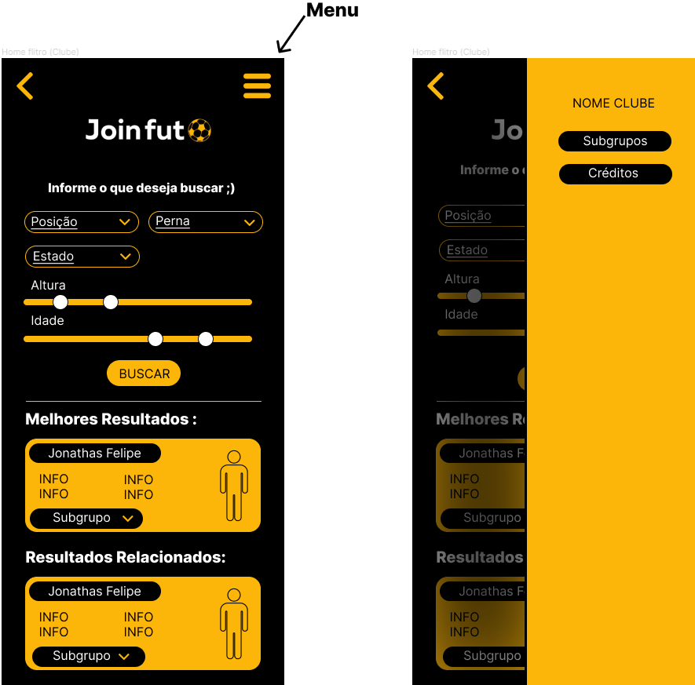

 

### Descrição:
Foi definido pela equipe que o fluxo do usuário clube, sua _homepage_ seria a tela de filtragem de atletas da aplicação. Nesta tela, o clube poderia selecionar atributos desejados em um atleta e o sistema da aplicação deveria devolver os atletas que mais se encaixam nas categorias. Há também um _widget_ no canto superior direito que leva para um menu lateral. Neste menu existem as opções: 
* Subgrupos: leva o clube para a tela de subgrupos.
* Créditos: ------------

 

## Subgrupos

  

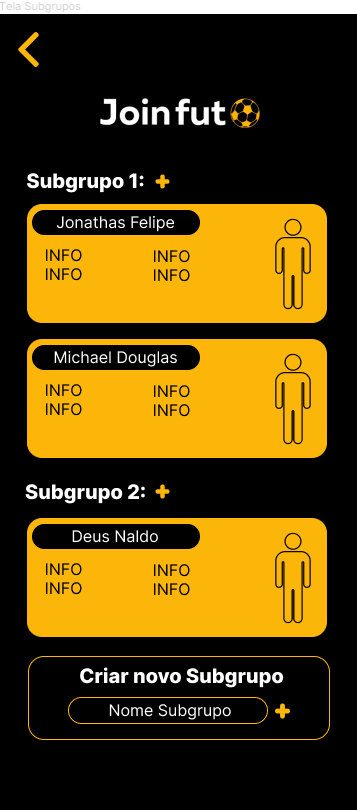

 

### Descrição:
Tela de subgrupos da aplicação. Nesta tela o clube pode visualizar as listas de atletas que faz parte de sua grupagem. É possível também criar um novo subgrupo e criar as pré seleções a partir de subgrupos já existentes. 

 

## Perfil do atleta

 

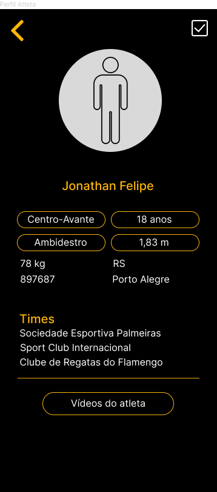

 

### Descrição:
A tela do perfil do atleta compõem as características do atleta em questão: estilo de jogo, posição, times que já passou e um botão que leva para uma tela que contém os vídeos do atleta. Essa tela pode ser acessada em ambos fluxos (atleta e clube). 

 

## Tela dos vídeos do atleta

 

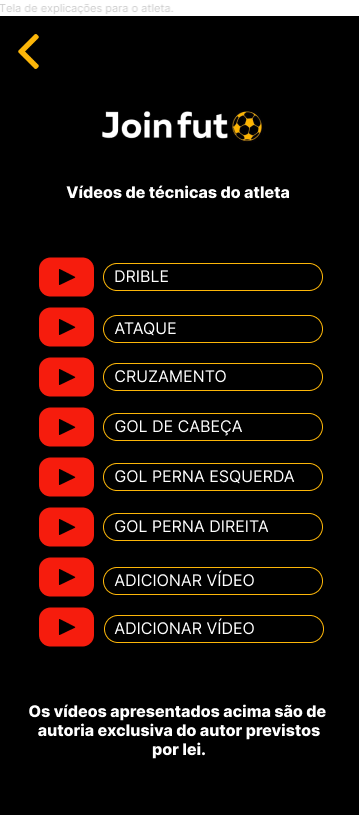

 

### Descrição:
A tela de vídeos do atleta constam os _links_ com os vídeos respectivos de cada categoria. Essa tela também é acessada por ambos fluxos (atleta e clube).

 

## Pré-seleção

 

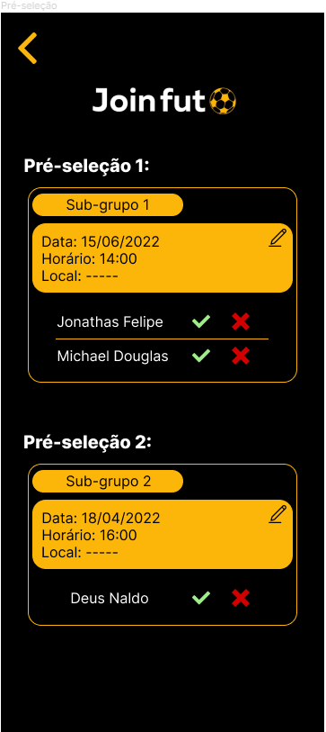

 

### Descrição:
A última tela pensada para completar o fluxo foi a tela de pré-seleção. Nessa tela o clube pode encontrar a lista de cada subgrupo que gerou uma pré seleção com os respectivos atletas listados e, a partir do contato com o Joinfut, atualizar o sistema indicando quais jogadores confirmaram presença na pré-seleção.

 

## Protótipos de Alto Nível

TBD

 

## Paleta de Cores
 

Os _stakeholders_ tinham posse de um logotipo pronto, juntamente com a sua paleta de cores, que foram mantidos pelo time na execução dos _mockups_. 

 

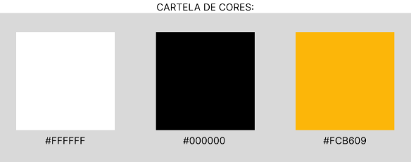

 

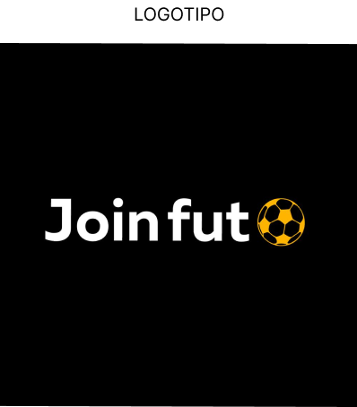

 

## Tipografia

 

Além da paleta de cores e do logotipo citados anteriormente, os _stakeholders_ também já possuíam uma fonte definida. 

 

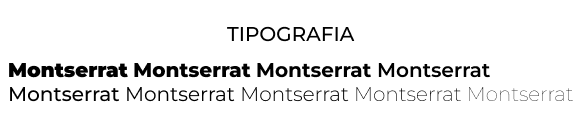

 

## Elementos Visuais

TBD
