[](home)
[](Instalação)

---

# Como instalar o Flutter


* [Windows](frontend/flutter_instalacao#windows)
* [Linux](frontend/flutter_instalacao#linux)

---

<a name="windows"></a>
## Windows


### Baixando o Android Studio

* Tenha o GIT instalado em seu computador
* Acesse o Link para fazer download do android studio: [**Download**⬇️](https://developer.android.com/studio/?hl=pt-pt)
* Após baixado, siga a instalação padrão clicando em Next até chegar no Install
* Após instalado, vai seguindo em next até a parte das licenças:

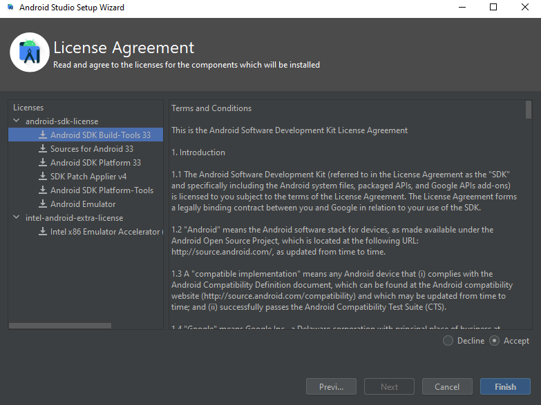

* Deixe ele instalar todos os componentes necessários

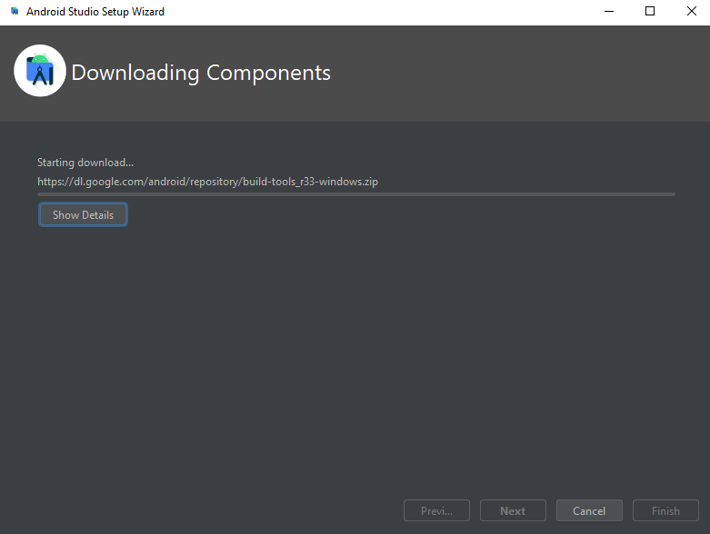

* Depois de instalado tudo ele chega nessa tela inicial

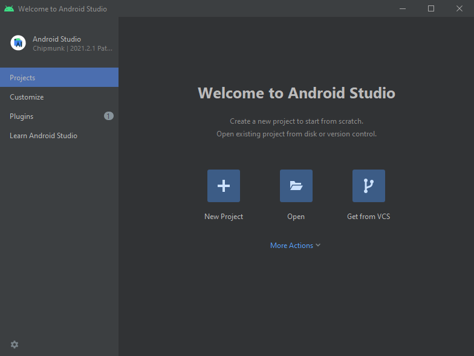


### Baixando o SDK do Flutter e configurando o Path

Baixe o SDK estável mais recente, pelo site [**Oficial**](https://docs.flutter.dev/get-started/install/windows#get-the-flutter-sdk)

Para nosso projeto iremos utilizar esta versão: [**Download**⬇️](https://storage.googleapis.com/flutter_infra_release/releases/stable/windows/flutter_windows_3.0.5-stable.zip)

extraia os dados do .zip e coloque na seguinte localização: **C:/src/flutter**

caso não tenha o diretório src, crie como abaixo

extraia tudo do .zip com o nome da pasta como flutter.

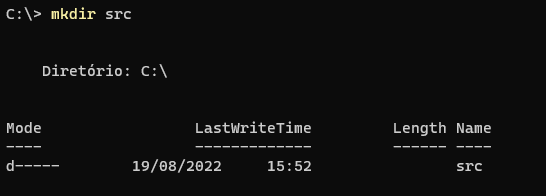

Acesse as variaveis de sistemas

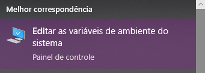

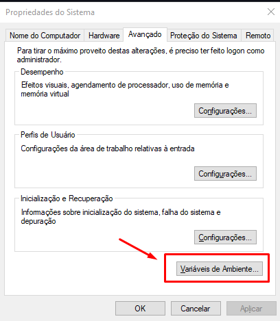

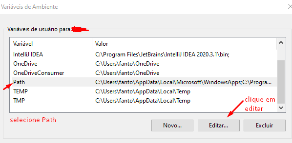


Coloque no path o caminho do bin do android studio, do Flutter e do dart que vem junto com Flutter.

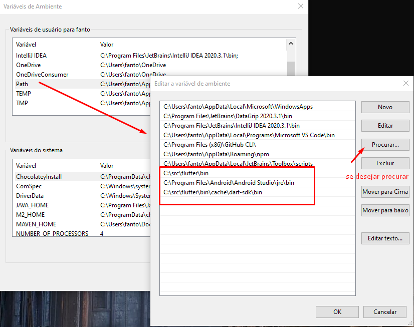

Coloque também nas variáveis do sistema o Flutter

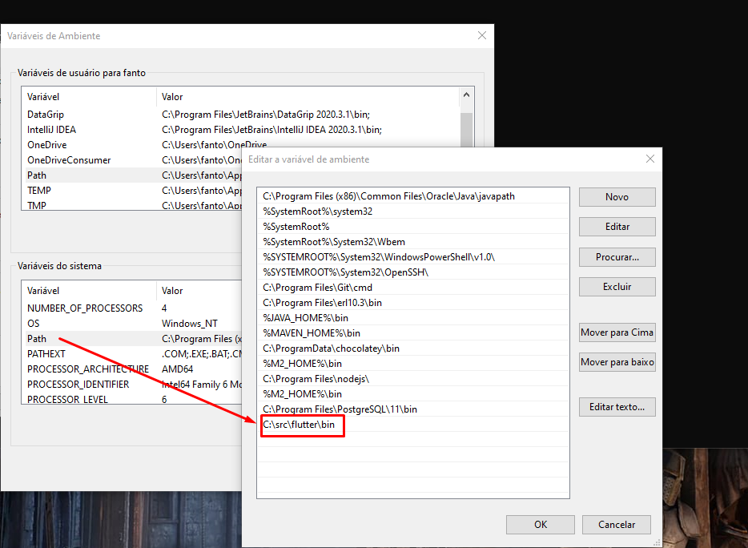

Reinicie o Windows

### Rodando o Flutter doctor

Flutter doctor serve para instalar os dados que faltam para rodar o flutter.

Abra um console direto na pasta do Flutter no **C:/src**

Rode o comando do [**Flutter Doctor**]()

Deve aparecer essas informações:

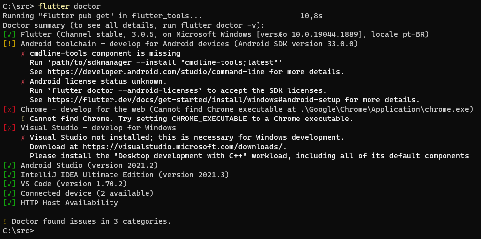

Na imagem acima diz que falta instalar o Google Chrome para desenvolvimento web, visual studio para desenvolvimento no windows e o android sdk

### Instalando Visual Studio


---

<a name="linux"></a>
## Linux

### Instalando o Android Studio

* Tenha o GIT instalado em seu computador
* Baixe o Android Studio por esse link: [**Download**](https://developer.android.com/studio/?hl=pt-pt)
* O android studio vai ser salvo como um arquivo **tar.gz**, para descompactar, utilize os comandos abaixo:

```shell
# va na pasta onde se encontra o arquivo e rode o seguinte comando
$ tar xzf android-studio-2021.2.1.16-linux.tar.gz
# acesse a nova pasta criada
$ cd android/studio
# acesse a pasta bin
$ cd bin
# execute o arquivo studio.sh
$ ./studio.sh
```

* Siga os passos de instalação clicando em **Next** e **Accept** em tudo


* Deixe ele instalar todos os componentes necessários


* Depois de instalado tudo ele chega nessa tela inicial


### Instalando o Flutter pelo GIT

* Podemos baixar a versão mais estável utilizando o seguinte comando no console

```shell
$ git clone https://github.com/flutter/flutter.git -b stable
```

* com isso, iremos pegar a versão mais recente do Flutter, se não é isso o desejado, pode ser baixado uma versão específica pelo [**Site Oficial**](https://docs.flutter.dev/get-started/install/linux)

* coloque o aplicativo do flutter em uma pasta específica, como o [**~/**]()

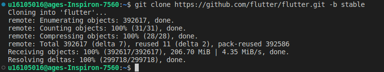

* Atualize o Path com o caminho até o diretório do Flutter, colocando no final do arquivo [**~/.bashrc**]()

```shell
$ export PATH="$PATH:~/flutter/bin"
```

* pelo VIM

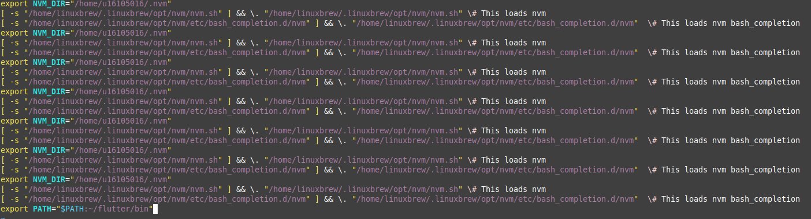

* Rode o comando **source** para atualizar o status do arquivo

```shell
$ source ~/.bashrc
```

* Para verificar se o path foi atualizado, use o comando echo, vai estar no fim do texto

```shell
$ echo $PATH
```

* Coloque o comando [**flutter**]() no console, se aparecer informações
* Ele vai baixar o Dart e outras dependencias iniciais

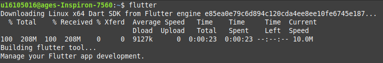

* Após baixado as coisas, ele vai mostrar o seguinte quadro


* Vá até o local onde o Flutter foi instalado e rode o seguinte comando no diretório do Flutter

```shell
$ flutter doctor
```


