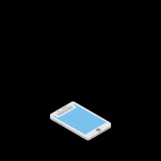

### Wiki normal

 

---

<table align="center"><tr><td align="center" width="9999">

# Área do Frontend do projeto Joinfut

</td></tr></table>

Aqui se encontram todas as documentações dos programas e como funciona o Frontend para que a equipe não se perca durante o desenvolvimento.

## Glossário

* **Instalação de Programas**

|Página|Descrição
|---|---|
|| Tutorial de instalação do Flutter no Linux e Windows
||TBD
||TBD
||TBD

* **Utilização dos Programas**

|Página|Descrição
|---|---|
||TBD
||TBD
||TBD
||TBD

* **Entendendo a estrutura**

|Página|Descrição
|---|---|
||TBD
||TBD
||TBD
||TBD
||TBD

* **Códigos úteis para o desenvolvimento**

|Página|Descrição
|---|---|
||TBD
||TBD
||TBD
||TBD
||TBD