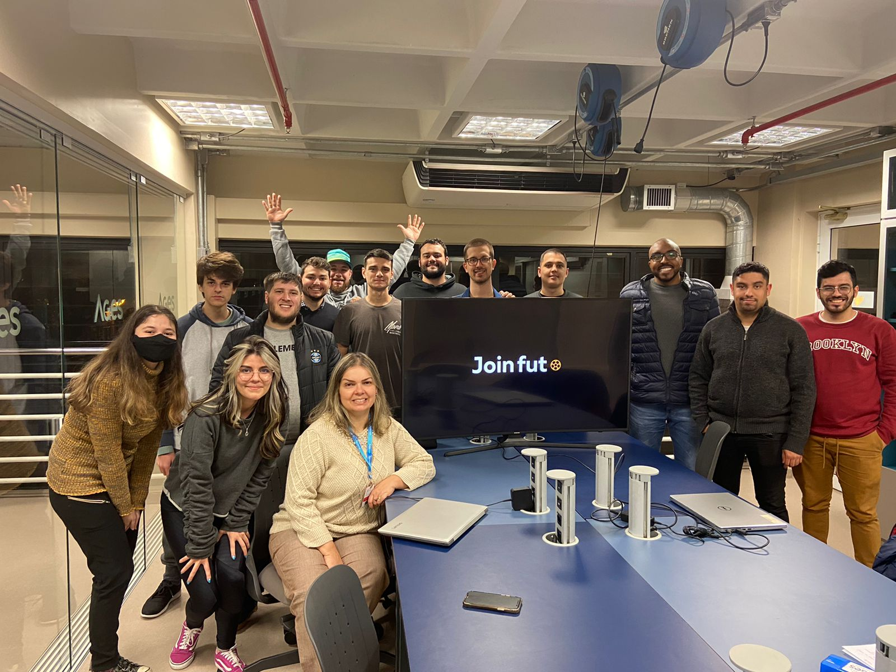

 

---

  
 
---

<table align="center"><tr><td align="center" width="9999">

# Bem vindo ao projeto JoinFut

Projeto desenvolvido na AGES 2022/2
</td></tr></table>

## Equipe

#### Stakeholders

* Lucas Zandona
* Paulo Francisco

#### Professor Orientador

* [Professora Ana Paula Bacelo](https://tools.ages.pucrs.br/ana.bacelo)

#### AGES I

* [Eduardo de Carvalho Meireles](https://tools.ages.pucrs.br/eduardo.meireles)
* [Rafael Dias Puhl](https://tools.ages.pucrs.br/rafael.puhl)
* [Thales Cordoni da Veiga](https://tools.ages.pucrs.br/thales.veiga)
* [Thiago Chies Claas](https://tools.ages.pucrs.br/thiago.claas)

#### AGES II

* [Alexya Silva Rocha de Oliveira](https://tools.ages.pucrs.br/alexya.oliveira)
* [Edson Ricardo da Costa](https://tools.ages.pucrs.br/edson.costa)
* [Vittoria Carolina da Silva Presa](https://tools.ages.pucrs.br/vittoria.silva)

#### AGES III

* [Christopher da Rosa Michel](https://tools.ages.pucrs.br/christopher.michel)
* [Gabriel Fanto Stundner](https://tools.ages.pucrs.br/gabriel.stundner)

#### AGES IV

* [João Pedro Picetti Medeiros](https://tools.ages.pucrs.br/joao.medeiros)
* [Vinicius Jaggi](https://tools.ages.pucrs.br/vinicius.jaggi)

## Imagem do time

