[](home)
[](processo)
[](design_mockups)
[](Instalação)
[](escopo)
[](arquitetura)
[](configuracao)
[](utilizacao)
[](codigo)
[](banco_dados)
[](qualidade)
[](markdown)
[](gerencia)
[](squads)
[](Retro)
[](estudos)

---

# Processo de Desenvolvimento

## Descrição

Os processos implementados são processos utilizados no mercado de trabalho em projetos de larga escala, para auxiliar os alunos a entenderem como se desenvolve em equipes de alto padrão e costumes para auxiliar na organização de novas demandas

## Sumário

- [Nomenclaturas](#nomenclatura)
- [Git Workflow](#git-workflow)
- [Wiki Workflow](#wiki-workflow)
- [Sincronização ao Github](#Sincronizacao)

## Nomenclaturas

---

Quando utilizamos o Gitlab/Github e queremos que o colega desenvolva um tópico específico, criamos algo chamado **Issue** no site de armazenamento de repositório, abaixo irei apresentar nomes e as nomenclaturas que iremos utilizar:

1. **Branch** = Local de trabalho do desenvolvedor, onde é uma cópia feita do diretório de desenvolvimento chamado _Master_ onde o desenvolvedor pode trabalhar tranquilo sem prejudicar o projeto, após finalizado a melhoria ou desenvolvimento feito nela, ele deve pedir para os supervisores verificarem se não vai prejudicar o projeto como um todo.
2. **Demanda** = Demanda é a nomenclatura na industria para definir a **Issue**, é um tópico de desenvolvimento que será desenvolvido por um programador e entregue para ser revisado.
3. **PR** = abreviação para **Pull Request** ou **Merge Request**, é uma requisição feita a partir de uma Branch para ser vinculado a Branch principal chamada _Master_.
4. **GIT** = Git é o software que utilizamos para gerenciar as alterações feitas no projeto, ele nos ajuda a desenvolver em equipe sem quebrar ou prejudicar o projeto do colega que está desenvolvendo junto ao mesmo tempo.

## Demandas

---

Uma demanda é um pedaço de tarefa que o desenvolvedor, é um pedaço de uma User Stories (US), onde deve ser apresentado o que o desenvolvedor deve fazer e entregar, tem que ser o mais direto e descritivo possível.

Para acessar as Demandas do projeto você tem que ir na aba **Issues** como mostra o vídeo abaixo:

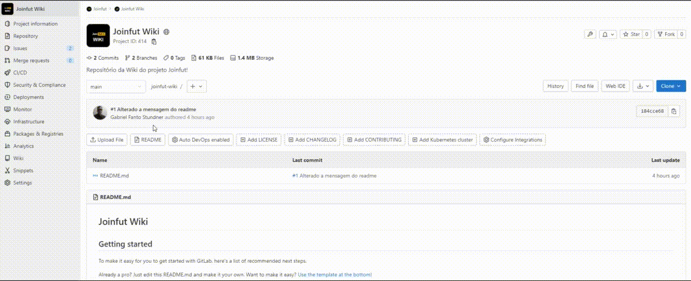

Temos uma estrutura de Issue específica, onde ela tem um template como esse abaixo:


Quando é criado a Issue ela tem as seguintes informações:


O mais importante, além das informações da Issue e quem é o responsável, é o **Código** dela, que iremos utilizar diariamente e direto em nosso projeto, como você vai ver na nomenclatura da Branch e na mensagem do Commit.
 


## Git Workflow

---

### Nomes

---

#### Branches

Como padrão para nomes de branches, foi decidido o seguinte:

```
<nomeColega>/<tipoDemanda>/<codigoDemanda>
```

Exemplo de branchs:

```
fanto/feature/#1
fanto/bugFix/#346
fanto/architecture/#1230
```

#### Componentes

Exemplo de Componentes:

```
component-navBar
component-slider
```

#### Páginas

Exemplo de Páginas:

```
page-recipes
page-creations
```

---

#### Criação de Branches

---

##### Criação pelo Gitlab

* Uma forma simples de criar uma Branch é direto no Gitlab, onde acesse a página inicial do repositório e siga as instruções do GIF abaixo:

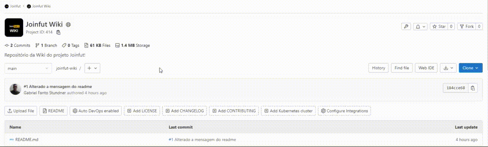

* A branch principal se chama **Main** e ela é bloqueada para não receber commits direto nela, por ser a Branch ativa que o cliente utiliza.

* Branches ativas são Branches que precisam estar 100% funcionando e que não devem ser mexidas se não foi validado e testado as modificações, podendo quebrar o projeto e ficar fora do ar para o cliente.

##### Criação pelo Console

* A forma mais comum de criação de uma Branch é pelo console (ou terminal) quando o repositório está clonado em sua maquina (mais informações em [Git]())

* Abaixo um video completo de criação de uma branch

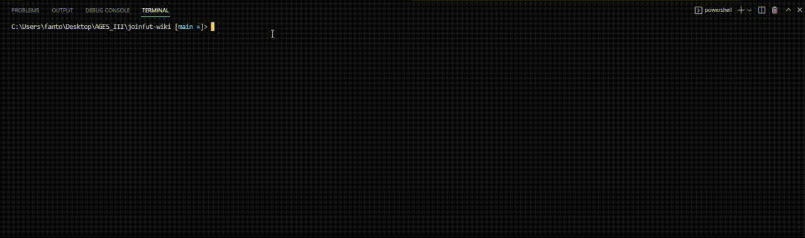

* Os comando utilizados são:

```
git pull
```
Git pull serve para trazer as atualizações que estão no repositório remoto (Gitlab)

```
git branch
```
Git branch serve para vermos qual é a Branch que estamos nesse momento, no vídeo tem uma extensão para powershell que mostra o nome da branch sempre que for um repositório GIT

```
git checkout -b fanto/architecure/#2
```
Git checkout -b serve para criar uma nova Branch e acessar ela automaticamente, onde ele espera que seja colocado o nome da branch depois do -b, essa Branch está seguindo o padrão definido no tópico nome de branches

```
git log
```
Git log serve para ver os Commits já feitos, onde mostra em qual Branch eles foram criados.

### Commits

---

#### Salvando Localmente

Para garantir que apenas o código necessário para funcionamento da tarefa lembre-se de realizar o comando `add` apenas nos arquivos **essenciais** para a tarefa:

```
git add <nomeDoArquivo>
```

Caso todos os arquivos modificados da Branch são essenciais, pode utilizar o ponto `.` para salvar todos os arquivos localmente, mas tenha muito cuidado para não salvar os arquivos que não são essenciais:

```
git add .
```

#### Padrão de Commits

Todos os commits devem começar com o **código da Issue** e uma mensagem direta do que foi feito naquele commit:

Exemplo de Issue:

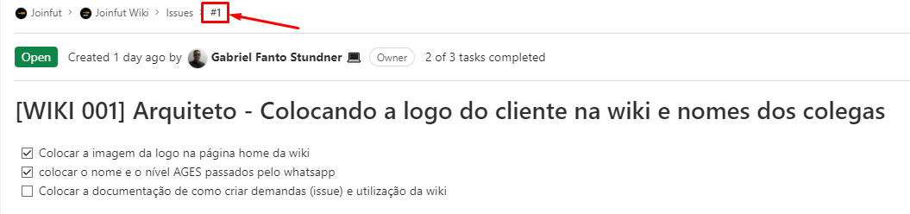

Esse código marcado é o que deve vir antes da mensagem em português do que foi feito:

```
git commit -m "#1 Atualizando os nomes dos colegas"
```

Com isso, vai vincular automaticamente a Issue ao commit, facilitando o trabalho dos revisores e colegas para saber de onde veio as alterações e o que foi feito

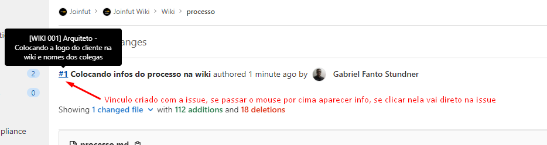

**ATENÇÃO** se o commit não estiver nessa estrutura, o commit vai ser invalidado e deverá ser feito um SQUASH de commits com a estrutura correta.

Não hesite em realizar vários commits, assim podemos ter documentado e salvo vários estados do desenvolvimento

---

#### Enviando modificações Remotamente

Depois de finalizar o desenvolvimento, envie todos os commits da sua máquina para o servidor remoto. Para isso depois de realizar as etapas de salvamento local, salve remotamente com o comando `push` sempre dizendo qual localização (origin) e o nome da branch, assim não terá conflitos de nomes e facilitará a verificar qual branch você está trabalhando:

```
git push origin fanto/architecture/#1
```

---

### Merge Requests

---

Depois de uma Demanda ter sido desenvolvida e estiver pronta de acordo com os critérios de aceitação, é necessário que a mesma seja enviada para a branch de desenvolvimento. Para isso é necessário abrir um Merge Request pela platafora GitLab:

#### Criando o Merge Request

A criação pode ser realizada na seção Merge Requests do repositório em que a branch foi criada. Clicando no botão `New Merge Request` siga os seguintes passos:

1. Selecionar a branch de origem (sua branch de desenvolvimento);
2. Selecionar a branch de destino (branch dev);
3. Selecione `Compare branches and continue`
4. Em `Title`, escreva um título que descreva a funcionalidade adicionada ou bug corrigido;
5. Em `Description`, escreva uma descrição com uma breve justificativa nos arquivos que foram alterados;
6. Na seção `Assignee`, selecione `Assign to me` para que fique registrado quem foi o responsável pelo desenvolvimento daquela tarefa (a pessoa selecionada será chamada caso o revisor tenha dúvidas sobre a tarefa);
7. Em `Milestone` selecione a Sprint em que a tarefa foi realizada;
8. Em `Labels`selecione qual é o tipo de tarefa que foi realizada;
9. Por último, revise se os arquivos que estão sendo enviados estão corretos e clique em `Submit Merge Request`.

#### Revisando o Merge Request

A revisão de merge request pode ser realizada por qualquer desenvolvedor, mas é preciso da aprovação de pelo menos um AGES III ou AGES IV para que a mesma seja incorporada na dev.

Na hora de revisar o Merge Request, entre na branch em sua máquina e teste a funcionalidade/bug/componente/tela de acordo com os critérios de aceitação apresentados no [Airtable](https://airtable.com/tblV0c8w2YX9PZAAC/viw4mJkZmd28WlplE?blocks=hide).

Caso haja pendências, relacionadas a documentação do código, padronização ou arquivos enviados, não exite em realizar um novo commit na branch com as mudanças necessárias antes de realizar a integração.

---

## Wiki Workflow

---

O desenvolvimento da wiki é feito de uma forma diferente, **NÃO DEVE SER ENVIADO OU MODIFICADO INFORMAÇÕES DIRETAMENTE NO GITLAB**.

O porque isso? imagens e arquivos são facilmente perdidos, ja houve projetos que foi perdido tudo que tinham no gitlab.

Para evitar isso, iremos trabalhar com a wiki como se estivessemos programando um projeto normal de desenvolvimento.

A wiki é um **Repositório** externo do Repositório pai, por isso podemos **Cloná-lo**:

Abaixo um video de como clonar a wiki para o seu computador:

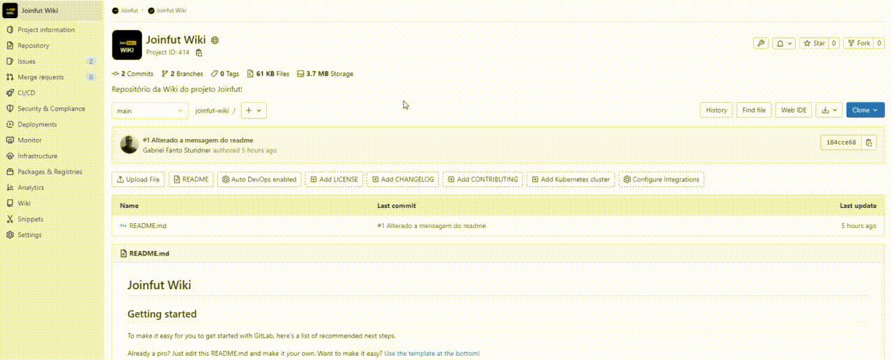

Acessamos a área de Wiki do projeto:

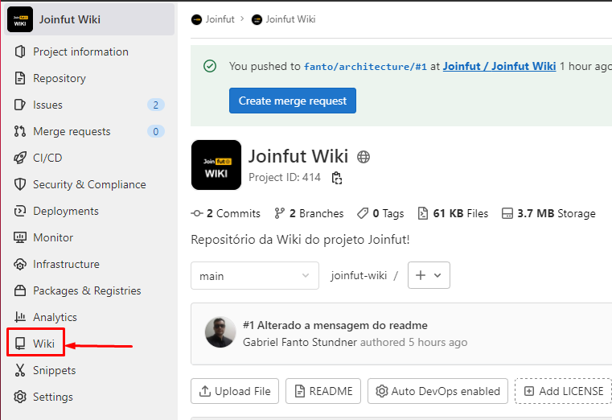

Depois clicamos no canto direito em **Clone repository**

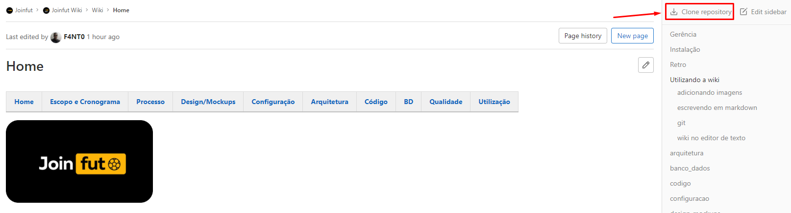

Clicamos no símbolo abaixo para copiar o link para podermos clonar a wiki

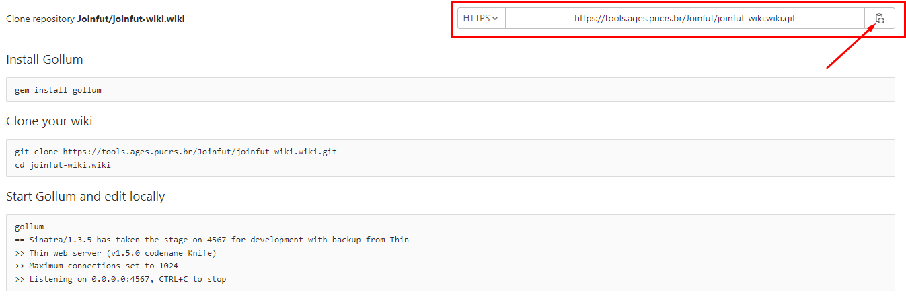

* Utilizamos em um terminal o comando **git clone url** para clonar na página atual o repositório
* Depois acessamos o repositório e usamos o comando **code .** para abrir o vscode com as páginas da wiki

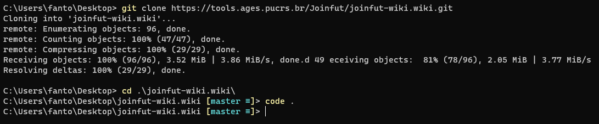

Pronto! a wiki já está salvo em seu computador, para enviar modificações são os mesmos processos de Commit apresentado no tópico do Git Workflow

A wiki são arquivos **markdown** com extensão **.md**, as imagens devem todas serem arrastadas e coladas na pasta **resources/images/** dentro da pasta sobre o assunto, dai para chamar a imagem faça como no vídeo mais abaixo, postando como funciona as pastas da wiki:

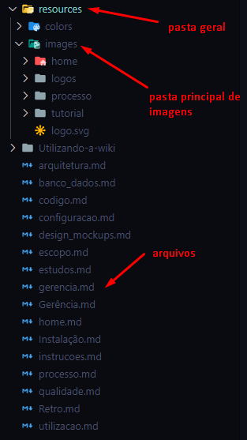

Para colocar essa imagem acima, faça como no vídeo abaixo:

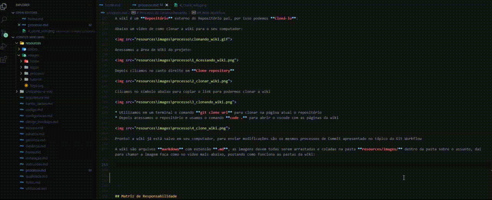

Para controlar o tamanho, só coloque o **width** (largura) e o **height** (altura) como no exemplo abaixo:

```

```

Exemplo: 


Na wiki fica assim o exemplo: 

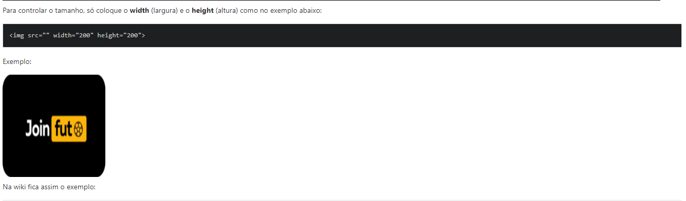

Para aprender mais sobre Markdown, só pesquisar na internet ou perguntar para seu AGES III, Gabriel Fanto

---

## Sincronização com o Github

A sincronização vai ocorrer todos os dias a meia noite, onde todo o trabalho feito do dia será enviado ao repositório de backup no github oficial do projeto

### Sincronização manual

É utilizado o comando git **remote** para definir para onde vai as atualizações, como no exemplo da wiki

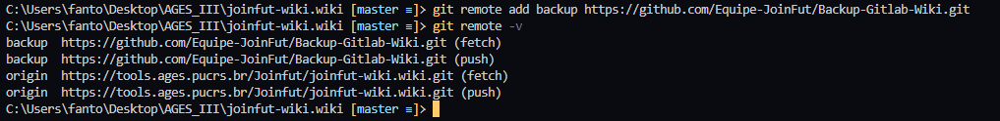

```
git remote add backup https://github.com/Equipe-JoinFut/Backup-Gitlab-Wiki.git
```

Esse comando serve para fazer um vinculo local do repositório da wiki do nosso projeto com o repositório de backup no github

Para verificar quais remotes você tem é usado o `git remote -v`

Para enviar as modificações, tem que ter a branch com o mesmo nome da nossa wiki, como o nome é **master** as atualizações vão para a branch de mesmo nome no github.

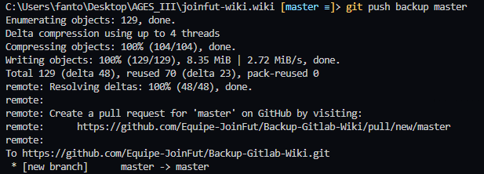

Por enquanto vai ser de uma forma manual para evitar de perder o backup feito, mais tarde será automatizado esse processo do gitlab para o github de forma sincronizada
